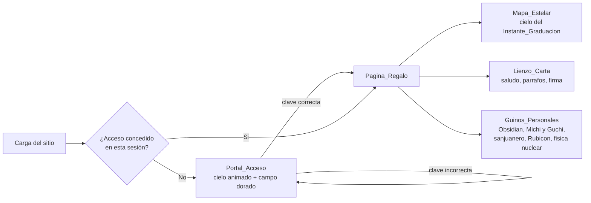
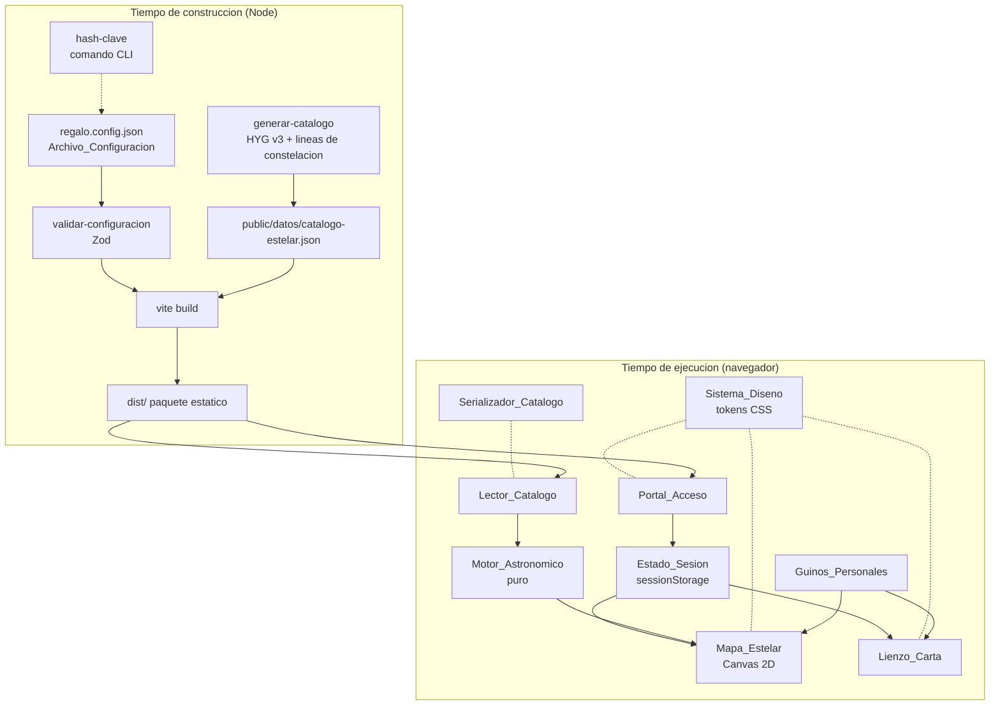
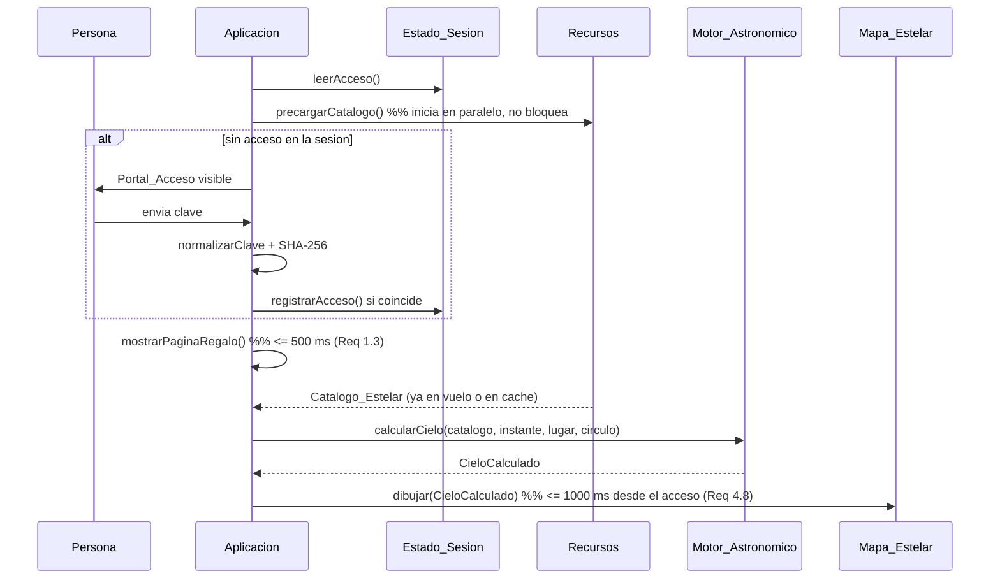

# Design Document

## Overview

KawaValen Graduation Gift es un **sitio estático de dos vistas** que se construye una vez, se publica en un hosting de archivos y funciona por completo dentro del navegador: sin backend propio, sin base de datos y sin peticiones a servicios propios en tiempo de ejecución (Requisito 8.7).

El diseño se organiza alrededor de cuatro decisiones estructurales:

1. **Todo el cálculo astronómico ocurre en el navegador, sobre datos empaquetados.** El Catalogo_Estelar se genera en tiempo de construcción a partir de catálogos públicos y viaja dentro del paquete como un archivo JSON estático. El Motor_Astronomico es código puro (sin E/S) que recibe el catálogo, el Instante_Graduacion y el Lugar_Graduacion, y devuelve posiciones. Esto hace que los Requisitos 2 y 3 sean verificables con pruebas basadas en propiedades.
2. **El Archivo_Configuracion es la única superficie de ajuste.** Hash_Clave, Instante_Graduacion, Lugar_Graduacion, saludo, párrafos de la Carta, firma e interruptores viven en un solo archivo validado antes de construir (Requisito 8). El Instante_Graduacion y el texto de la Carta quedan como **valores marcador (placeholders)** claramente señalados hasta que el autor los confirme.
3. **La clave es una puerta ceremonial, no un control de seguridad.** El paquete distribuido contiene solo el Hash_Clave SHA-256; la Clave_Acceso en texto claro nunca entra al repositorio ni al paquete. Cualquier persona con herramientas de desarrollo puede evitar la puerta, y el diseño lo asume de forma explícita (ver *Consideración de seguridad*).
4. **La belleza es un requisito funcional.** La Paleta_Regalo, la tipografía, el ritmo de las animaciones y el respeto por la preferencia de movimiento reducido se modelan como un **sistema de diseño con tokens** verificable (contraste, tamaños, áreas táctiles), no como decisiones dispersas en hojas de estilo.

### Recorrido de la persona



### Elección tecnológica y justificación

| Decisión | Elección | Justificación |
| --- | --- | --- |
| Lenguaje | **TypeScript** en modo estricto | Los modelos de datos (Estrella, Segmento, ConfiguracionRegalo) tienen invariantes numéricos densos; el tipado estático evita una clase completa de errores y documenta las unidades en los nombres de tipo. |
| Empaquetador | **Vite 5** con `base: './'` | Genera un `dist/` de archivos estáticos con rutas relativas, publicable tal cual en GitHub Pages, Netlify o Cloudflare Pages (Requisito 8.7). Su ciclo de construcción permite insertar la validación del Archivo_Configuracion como paso previo (Requisitos 8.3–8.5). |
| Capa de vista | **DOM + módulos TypeScript propios, sin framework de UI** | La Aplicacion tiene dos vistas y un puñado de estados. Un framework añadiría peso de descarga (contra el Requisito 7.7: primer dibujo ≤ 2500 ms a 1.6 Mbps) sin aportar valor. La lógica interesante vive en módulos puros, no en componentes. |
| Dibujo del cielo | **Canvas 2D** | Hasta 3000 estrellas más líneas de constelación y titileo a ≥ 30 fps (Requisitos 4.1, 7.8). Con SVG serían miles de nodos en el DOM; con WebGL el costo de complejidad y de compatibilidad no se justifica para esta densidad. Canvas 2D permite además un redibujo completo por cambio de tamaño (Requisito 4.12) en un solo paso. |
| Fondo del Portal_Acceso | **DOM + CSS `@keyframes`** | Los 80–200 puntos luminosos del Requisito 6.3 se animan en el compositor, sin ocupar el hilo principal, y se desactivan con una sola consulta `prefers-reduced-motion` (Requisito 7.5). |
| Hash SHA-256 | **Web Crypto (`crypto.subtle.digest`)** en el navegador y **`node:crypto`** en el comando de construcción | Sin dependencias y con el mismo algoritmo en ambos lados. Web Crypto exige contexto seguro (HTTPS o `localhost`), lo que motiva la ruta de respaldo del Requisito 1.11. |
| Validación de configuración | **Zod** en un script de `prebuild` | Los Requisitos 8.1, 8.3, 8.4, 8.8, 8.9 y 8.10 son un esquema con rangos y mensajes; Zod los expresa de forma declarativa y produce el informe de campos ausentes o inválidos. |
| Pruebas | **Vitest** + **fast-check** (propiedades) + **jsdom** (vistas) | fast-check es la biblioteca de property-based testing estándar del ecosistema TypeScript y cubre las nueve propiedades declaradas en los requisitos. Vitest comparte la configuración de Vite, así que no hay una segunda cadena de construcción. |
| Verificación de rendimiento y respuesta | **Playwright** (guion aparte, no en la suite unitaria) | Los Requisitos 4.8, 7.7 y 7.8 son mediciones de navegador real; se comprueban con un guion de trazas, no con pruebas basadas en propiedades. |
| Fuentes tipográficas | **Autoalojadas en woff2 subconjunto latino** | Requisito 8.7 (sin peticiones a servicios ajenos) y Requisito 7.7 (presupuesto de descarga). |

### Presupuesto de descarga (Requisito 7.7)

A 1.6 Mbps con 300 ms de latencia, 2500 ms de presupuesto dan aproximadamente 400 kB útiles para el primer dibujo. Por eso el Portal_Acceso es una **ruta crítica mínima**: HTML + CSS crítico + módulo del portal (objetivo ≤ 60 kB comprimido). El Catalogo_Estelar (≈ 250–350 kB sin comprimir, ≈ 90 kB con Brotli), las fuentes serif de la Carta, los Guinos_Personales y el audio del sanjuanero **no bloquean** el portal: se piden en paralelo y en segundo plano.

---

## Architecture

### Vista de capas



### Reglas de dependencia

- **El núcleo es puro.** `Lector_Catalogo`, `Serializador_Catalogo` y `Motor_Astronomico` no conocen el DOM, `fetch`, `Date.now()` ni `Math.random()`. Reciben datos y devuelven datos o errores. Esta regla es la que hace posible ejecutar 100+ iteraciones de propiedades en milisegundos.
- **La E/S vive en el borde.** Un único módulo `infra/recursos.ts` concentra `fetch`, `sessionStorage` y `crypto.subtle`, cada uno detrás de una interfaz sustituible en pruebas.
- **Las vistas no calculan.** `Mapa_Estelar` y `Lienzo_Carta` reciben estructuras ya resueltas (`CieloCalculado`, `CartaResuelta`) y solo dibujan y responden a eventos.
- **El tiempo y el azar se inyectan.** El titileo del cielo recibe una fuente de números pseudoaleatorios con semilla derivada del Instante_Graduacion, para que el Requisito 3.6 (determinismo) se cumpla también en lo visual.

### Estructura del repositorio

```
kv-graduation-degree-gift/
├── regalo.config.json              # Archivo_Configuracion (unica superficie de ajuste)
├── index.html
├── package.json                    # scripts: hash-clave, generar-catalogo, dev, build, test
├── vite.config.ts
├── datos-fuente/                   # insumos versionados, NO se publican
│   ├── hygdata_v3.csv              # HYG v3 (CC BY-SA 2.5)
│   ├── constellations.lines.json   # lineas de constelacion (BSD-3-Clause)
│   └── CREDITOS.md                 # atribuciones obligatorias
├── public/
│   ├── datos/catalogo-estelar.json # Catalogo_Estelar generado
│   ├── audio/sanjuanero.mp3        # opcional (interruptor de musica)
│   └── fuentes/*.woff2
├── herramientas/                   # solo Node, tiempo de construccion
│   ├── hash-clave.ts               # Requisito 8.6
│   ├── generar-catalogo.ts
│   └── validar-configuracion.ts    # Requisitos 8.1, 8.3, 8.4, 8.8, 8.9, 8.10
├── src/
│   ├── nucleo/                     # puro, sin DOM
│   │   ├── clave.ts                # normalizarClave (compartido con la CLI)
│   │   ├── catalogo/{modelo,lector,serializador}.ts
│   │   ├── astronomia/{tiempo,precesion,horizontales,proyeccion,motor}.ts
│   │   └── carta/resolver.ts
│   ├── vista/
│   │   ├── portal/{portal,cielo-fondo}.ts
│   │   ├── mapa/{mapa,capas,etiquetas,interaccion,radio}.ts
│   │   ├── carta/lienzo.ts
│   │   └── guinos/{obsidian,decoraciones,audio}.ts
│   ├── infra/{recursos,sesion,hash,movimiento-reducido}.ts
│   └── estilos/{tokens,base,portal,mapa,carta,respuesta}.css
└── pruebas/
    ├── propiedades/*.prop.test.ts
    ├── unitarias/*.test.ts
    ├── referencia/almanaque.json    # Requisito 3.8
    └── navegador/rendimiento.spec.ts
```

### Secuencia de arranque



La **precarga del catálogo comienza al cargar la página**, mientras la persona escribe la clave. Cuando el acceso se concede, lo habitual es que el catálogo ya esté disponible, lo que deja el presupuesto de 1000 ms del Requisito 4.8 casi íntegro para el cálculo (≤ 300 ms por Requisito 3.11) y el primer dibujo.

### Fuente del Catalogo_Estelar y empaquetado

El catálogo **no se descarga en tiempo de ejecución desde un tercero**: se genera una vez y se publica como archivo estático junto al resto del paquete.

- **Estrellas:** [HYG Database v3](https://github.com/astronexus/hyg-database) (combinación de Hipparcos, Yale Bright Star y Gliese-Jahreiß, época y equinoccio J2000.0), distribuida bajo Creative Commons Attribution-ShareAlike 2.5. El contenido fue parafraseado de la descripción del repositorio para cumplir las restricciones de licencia.
- **Líneas de constelación:** figuras de líneas identificadas por número HIP, tomadas de [d3-celestial](https://github.com/ofrohn/d3-celestial) (BSD-3-Clause). Alternativa documentada: [constellation-lines](https://github.com/doinab/constellation-lines) (Creative Commons), si se prefiere un trazado con referencias bibliográficas.

`herramientas/generar-catalogo.ts` ejecuta, sin red y de forma reproducible:

1. Filtra HYG por magnitud aparente **≤ 5.5** y descarta el Sol. Resultan ≈ 2 870 estrellas: por debajo del máximo de 3000 dibujables (Requisitos 3.11 y 4.1) y del máximo de 5000 entradas admitidas por el Lector_Catalogo (Requisito 2.1).
2. Asigna un `nombre` único y no vacío por estrella con precedencia: nombre propio → designación Bayer → designación Flamsteed → `HIP <n>`. Si aún hubiera colisión, añade un sufijo determinista; así se evita de raíz el error del Requisito 2.10.
3. Copia `ar` (ascensión recta en horas), `dec` (declinación en grados), `magnitud` (magnitud aparente) y `constelacion` (nombre de la constelación en español cuando existe traducción estable; si no, la abreviatura IAU).
4. Resuelve cada par HIP de las líneas de constelación a nombres del paso 2. **Descarta** los segmentos con algún extremo ausente (por el corte de magnitud) y los segmentos degenerados con el mismo nombre en ambos extremos, de modo que el archivo generado nunca viole los Requisitos 2.4 ni 2.9.
5. Serializa con el **Serializador_Catalogo** (el mismo módulo que usa la Aplicacion) y vuelve a leerlo con el **Lector_Catalogo**. Si la relectura falla o no es equivalente, el guion termina con error: el catálogo publicado siempre satisface las propiedades de ida y vuelta.
6. Escribe `public/datos/catalogo-estelar.json` y copia las atribuciones a `datos-fuente/CREDITOS.md`.

En tiempo de ejecución el archivo se obtiene con `fetch('datos/catalogo-estelar.json')` y `AbortController` a los **3000 ms** (Requisito 2.8), con un cronómetro independiente de **5000 ms** para la lectura completa (Requisito 4.13). Es una petición al mismo hosting estático que sirve el HTML, no a un servicio propio; se mantiene como petición (en lugar de incrustar el JSON en el paquete) precisamente porque los requisitos exigen rutas de respaldo ante indisponibilidad y demora, y porque así el catálogo se almacena en caché por separado y no penaliza el primer dibujo del portal.

**Nota de licencia:** por la cláusula ShareAlike de CC BY-SA 2.5, `catalogo-estelar.json` se distribuye bajo esa misma licencia y con atribución visible; el código de la Aplicacion mantiene su propia licencia. La Pagina_Regalo incluye una línea de créditos discreta, con los colores de la Paleta_Regalo, que satisface la atribución sin romper el Requisito 6.1.

---

## Components and Interfaces

### 1. Portal_Acceso (`src/vista/portal/portal.ts`)

Responsabilidad: pedir la Clave_Acceso, validarla contra el Hash_Clave y conceder el acceso.

```ts
export interface DependenciasPortal {
  readonly hashClave: string;                 // 64 hex minusculas
  readonly digerir: (texto: string) => Promise<string | null>; // null = SHA-256 no disponible
  readonly sesion: EstadoSesion;
  readonly alConcederAcceso: () => void;
}

export type EstadoPortal =
  | { readonly clase: 'reposo' }
  | { readonly clase: 'verificando' }
  | { readonly clase: 'reintento'; readonly mensaje: 'Esa no es la clave, inténtalo de nuevo' }
  | { readonly clase: 'sin-validacion'; readonly mensaje: string }   // Requisito 1.11
  | { readonly clase: 'concedido' };

export function montarPortal(raiz: HTMLElement, deps: DependenciasPortal): { destruir(): void };
```

Comportamiento clave:

- Texto fijo `Si eres KawaValen, por favor digita la clave de acceso`, `<input type="password" maxlength="64">` y botón de ingreso (Requisito 1.1). La Pagina_Regalo se mantiene fuera del árbol accesible con `hidden` hasta la concesión.
- El botón permanece `disabled` mientras `normalizarClave(valor).length === 0`, y el envío se ignora en ese estado (Requisito 1.5).
- `Enter` en el campo dispara el mismo envío que el botón, mediante un `<form>` real con `submit` (Requisitos 1.8 y 7.10).
- Sin límite de intentos ni retardo (Requisito 1.10): no hay contador de intentos en el diseño.
- Éxito: registra la sesión y muestra la Pagina_Regalo. Fracaso: limpia el campo, devuelve el foco y muestra el mensaje de reintento, que persiste hasta el siguiente envío (Requisito 1.4).
- Si `digerir` devuelve `null` (Web Crypto ausente o contexto no seguro), pasa a `sin-validacion` y **no** concede acceso (Requisito 1.11).

#### Normalización de la Clave_Acceso (`src/nucleo/clave.ts`)

```ts
/** Requisito 1.2: recorta solo espacios en blanco de los extremos y pasa a minusculas. */
export function normalizarClave(entrada: string): string {
  return entrada.trim().toLowerCase();
}
```

Este módulo **se comparte** entre el navegador y el comando `hash-clave`, de modo que el Requisito 8.6 (misma normalización) no puede desincronizarse. Decisión explícita: **no** se aplica normalización Unicode (NFC/NFD), porque el Requisito 1.2 define la normalización de forma exhaustiva. Consecuencia documentada en el README: la Clave_Acceso debería usar solo caracteres ASCII para evitar ambigüedad entre secuencias compuestas y descompuestas.

### 2. Lector_Catalogo (`src/nucleo/catalogo/lector.ts`)

```ts
export type ResultadoLectura =
  | { readonly ok: true; readonly catalogo: CatalogoEstelar }
  | { readonly ok: false; readonly error: ErrorCatalogo };

/** Analiza y valida un documento JSON del Catalogo_Estelar. Funcion pura. */
export function leerCatalogo(textoJson: string): ResultadoLectura;

/** Obtiene el documento y lo lee. Aplica los limites de 3000 ms (Req 2.8) y 5000 ms (Req 4.13). */
export function obtenerCatalogo(
  traer: Traer,
  reloj: Reloj,
  ruta: string,
): Promise<ResultadoLectura>;
```

Orden de validación (determina qué error se reporta primero):

1. Sintaxis JSON → `sintaxis-invalida` con la posición del carácter (Requisito 2.2). Se obtiene del mensaje de `JSON.parse` y, como respaldo por si el navegador no la incluye, con un recorrido propio que localiza el desajuste.
2. Forma del documento y límites de cantidad: 1–5000 estrellas, ≤ 20000 segmentos (Requisito 2.1).
3. Por cada estrella, en orden: campos ausentes o cadenas vacías (Requisito 2.9) → rangos `ar ∈ [0,24)`, `dec ∈ [-90,90]`, `magnitud ∈ [-1.5,6.0]` (Requisito 2.3) → longitud ≤ 64 de `nombre` y `constelacion`.
4. Nombres duplicados (Requisito 2.10).
5. Por cada segmento: extremos existentes y distintos entre sí (Requisito 2.4).

En cualquier fallo devuelve `ok: false` y **ninguna** colección parcial (Requisitos 2.2 y 2.8): las colecciones se construyen en variables locales y solo se publican al final.

### 3. Serializador_Catalogo (`src/nucleo/catalogo/serializador.ts`)

```ts
/** Requisito 2.5: JSON con los cinco campos por Estrella y al menos 6 decimales en los numericos. */
export function serializarCatalogo(catalogo: CatalogoEstelar): string;
```

Decisión de implementación relevante: `JSON.stringify` no puede forzar la cantidad de decimales de un número (`6.75` se emite como `6.75`). El serializador **compone el texto JSON campo por campo** e inserta los valores numéricos con `valor.toFixed(6)`, que sigue siendo un literal numérico JSON válido (`6.750000`). Redondear a 6 decimales introduce un error máximo de 5·10⁻⁷, por debajo de la tolerancia de 10⁻⁶ que exigen los Requisitos 2.6 y 2.7. El escape de cadenas se delega a `JSON.stringify` para `nombre`, `constelacion` y los extremos de cada segmento.

### 4. Motor_Astronomico (`src/nucleo/astronomia/`)

Cuatro módulos puros y una fachada.

```ts
// tiempo.ts
export function diaJuliano(msUtc: number): number;
export function siglosJulianos(jd: number): number;
export function tsmGreenwichGrados(jd: number): number;   // GMST
export function tsLocalGrados(jd: number, longitudGrados: number): number;

// precesion.ts  (J2000.0 -> equinoccio de la fecha y su inversa)
export function precesarDesdeJ2000(eq: Ecuatorial, jd: number): Ecuatorial;
export function precesarHaciaJ2000(eq: Ecuatorial, jd: number): Ecuatorial;

// horizontales.ts
export function aHorizontales(eq: Ecuatorial, lat: number, tsLocal: number): Horizontal;
export function aEcuatoriales(h: Horizontal, lat: number, tsLocal: number): Ecuatorial;

// proyeccion.ts
export function proyectar(h: Horizontal, c: CirculoHorizonte): Punto;
export function desproyectar(p: Punto, c: CirculoHorizonte): Horizontal;

// motor.ts (fachada)
export type ResultadoCielo =
  | { readonly ok: true; readonly cielo: CieloCalculado }
  | { readonly ok: false; readonly error: ErrorMotor };

export function calcularCielo(
  catalogo: CatalogoEstelar,
  instante: InstanteGraduacion,
  lugar: LugarGraduacion,
  circulo: CirculoHorizonte,
): ResultadoCielo;
```

`calcularCielo` valida primero el Instante_Graduacion y el Lugar_Graduacion y, si algo está fuera de rango o no es interpretable, **no produce ninguna coordenada** y devuelve el campo y el valor recibidos (Requisito 3.9). Las estrellas con altitud negativa se marcan `visible: false` y **no** reciben coordenadas de pantalla (Requisito 3.10).

#### Fórmulas

Las fórmulas siguen a Jean Meeus, *Astronomical Algorithms* (2ª ed.), y a la [nota de tiempo sidéreo del U.S. Naval Observatory](https://aa.usno.navy.mil/faq/GAST). Todos los ángulos se manejan internamente en grados y se convierten a radianes solo dentro de las llamadas trigonométricas.

**(a) Día juliano.** A partir de los milisegundos UTC del Instante_Graduacion (la conversión desde ISO 8601 con desplazamiento −05:00 la hace `Date.parse`, que es exacta para ese formato):

```
JD = 2440587.5 + msUtc / 86 400 000
T  = (JD − 2451545.0) / 36525
```

**(b) Tiempo sidéreo medio de Greenwich**, en grados (Meeus 12.4):

```
GMST = 280.46061837
     + 360.98564736629 · (JD − 2451545.0)
     + 0.000387933 · T²
     − T³ / 38 710 000            (mod 360)
```

**(c) Tiempo sidéreo local**, con longitud **positiva hacia el este** (Neiva: −75.2819):

```
TSL = (GMST + longitud) mod 360
```

Se usa tiempo sidéreo **medio**, no aparente: la ecuación de los equinoccios no supera ≈ 1.1 s de tiempo, es decir ≈ 0.0046°, dos órdenes de magnitud por debajo del margen de 0.1° del Requisito 3.8.

**(d) Precesión J2000.0 → equinoccio de la fecha** (Meeus 21.3). Este paso **no es opcional**: entre J2000.0 y una fecha de 2025 la precesión desplaza las posiciones hasta ≈ 0.35°, más del triple del margen del Requisito 3.8. Con época inicial J2000.0 y `t = (JD − 2451545.0)/36525`, en segundos de arco:

```
ζ = 2306.2181·t + 0.30188·t² + 0.017998·t³
z = 2306.2181·t + 1.09468·t² + 0.018203·t³
θ = 2004.3109·t − 0.42665·t² − 0.041833·t³

A = cos δ₀ · sin(α₀ + ζ)
B = cos θ · cos δ₀ · cos(α₀ + ζ) − sin θ · sin δ₀
C = sin θ · cos δ₀ · cos(α₀ + ζ) + cos θ · sin δ₀

α = z + atan2(A, B)      δ = asin(C)
```

La inversa reutiliza los mismos ζ, z y θ intercambiando papeles (`α₀ + ζ = atan2(A', B')` con `A' = cos δ · sin(α − z)`, `B' = cos θ · cos δ · cos(α − z) + sin θ · sin δ`, `C' = −sin θ · cos δ · cos(α − z) + cos θ · sin δ`), lo que la vuelve invertible y hace que la propiedad de ida y vuelta del Requisito 3.3 se cumpla también sobre el paso completo del canal.

Efectos deliberadamente omitidos, con su magnitud máxima: nutación ≈ 0.005°, aberración anual ≈ 0.006°, movimiento propio de las 20 estrellas más brillantes en 25 años ≈ 0.016°, paralaje diurno estelar despreciable. La suma queda muy por debajo de 0.1°. La **refracción atmosférica** (≈ 0.57° en el horizonte) se excluye a propósito: el Requisito 3.2 pide altitud geométrica y los valores de referencia del Requisito 3.8 se registran también como geométricos.

**(e) Ecuatoriales → horizontales.** Con `α` en grados (`α = ar · 15`), ángulo horario `H = TSL − α` normalizado a `[−180, 180)`, latitud `φ`:

```
sin(alt) = sin φ · sin δ + cos φ · cos δ · cos H
Az       = atan2( −cos δ · sin H ,  sin δ · cos φ − cos δ · sin φ · cos H )   (mod 360)
```

`Az` queda medido desde el norte geográfico y creciente hacia el este, en `[0, 360)`; `alt` en `[−90, 90]` (Requisito 3.2). Se usa `atan2` en lugar de `asin`/`acos` para evitar la pérdida de precisión cerca del cenit y las ramas ambiguas.

**(f) Horizontales → ecuatoriales** (inversa exacta de (e)):

```
sin δ = sin(alt) · sin φ + cos(alt) · cos φ · cos Az
H     = atan2( −cos(alt) · sin Az ,  sin(alt) · cos φ − cos(alt) · sin φ · cos Az )
α     = (TSL − H) mod 360        →    ar = α / 15
```

**(g) Proyeccion_Estereografica** centrada en el cenit. Con distancia cenital `z = 90° − alt` y radio del Circulo_Horizonte `R`:

```
r = R · tan(z / 2)                  (z = 0 → r = 0 ;  z = 90° → r = R)
x = cx − r · sin(Az)
y = cy − r · cos(Az)
```

El signo negativo en `x` orienta el mapa como se ve **mirando hacia arriba**: norte arriba y este a la izquierda, la convención de los planisferios celestes. Las marcas cardinales del Requisito 4.7 se colocan con la misma fórmula en `Az = 0, 90, 180, 270` y `alt = 0`, así que su desviación es nula por construcción, muy por debajo del grado admitido.

Inversa:

```
r   = hypot(x − cx, y − cy)
Az  = atan2( −(x − cx), −(y − cy) )   (mod 360)
z   = 2 · atan(r / R)                 →   alt = 90° − z
```

Por construcción, `alt = 0 ⇒ r = R` exactamente (salvo redondeo de punto flotante) y `alt > 0 ⇒ r < R`, que es el invariante del Requisito 3.5. La proyección estereográfica se elige sobre la ortográfica y la equidistante porque preserva los ángulos: las constelaciones conservan su forma reconocible cerca del horizonte, que es lo que hace que el mapa se sienta como el cielo y no como un diagrama.

**(h) Determinismo (Requisito 3.6).** El motor no consulta el reloj ni fuentes de azar; toda la aritmética es IEEE-754 de doble precisión, con la misma secuencia de operaciones en cada invocación. Se prohíbe explícitamente `Math.fround`, la acumulación incremental de ángulos y la iteración sobre estructuras de orden no determinista (`Set`/`Map` de claves numéricas) dentro del motor. Dos invocaciones con las mismas entradas devuelven bits idénticos, no solo valores cercanos.

**(i) Coste.** 2 870 estrellas × (precesión + conversión + proyección) ≈ 40 operaciones trigonométricas por estrella, del orden de 10⁵ operaciones en total: unidades de milisegundos, con amplio margen frente a los 300 ms del Requisito 3.11.

### 5. Mapa_Estelar (`src/vista/mapa/`)

```ts
export interface OpcionesMapa {
  readonly cielo: CieloCalculado | null;      // null = ruta de respaldo
  readonly rotulo: RotuloLugarFecha;
  readonly guinos: boolean;
  readonly movimientoReducido: boolean;
}

export function montarMapa(lienzo: HTMLCanvasElement, op: OpcionesMapa): ControlMapa;

export interface ControlMapa {
  redibujar(): void;
  redimensionar(ancho: number, alto: number): void;   // Requisito 4.12
  textoAlternativo(): string;                          // Requisito 7.6
  destruir(): void;
}
```

Orden de capas (de atrás hacia adelante), cada una en una función propia para poder probarlas por separado:

1. Degradado de fondo (negro profundo → azul noche) y disco del Circulo_Horizonte.
2. Retícula tenue en azul eléctrico con baja opacidad: círculos de altitud cada 30° y radios cada 45°.
3. Líneas de constelación, grosor 1.0 px (dentro del rango 0.5–1.5 del Requisito 4.3), solo cuando **ambos** extremos tienen altitud ≥ 0 (Requisito 4.15).
4. Constelación **Obsidian** en dorado, si los Guinos_Personales están activados y al menos 5 de sus estrellas están sobre el horizonte (Requisitos 6.4 y 6.9).
5. Estrellas: disco más halo radial, con radio en función de la magnitud.
6. Etiquetas de estrellas brillantes y marcas cardinales N, E, S, O.
7. Rótulo de lugar y fecha, y capa de información de la estrella señalada.

**Radio por magnitud** (`radio.ts`, Requisito 4.2):

```ts
export function radioPorMagnitud(magnitud: number): number {
  const m = Math.min(6.0, Math.max(-1.5, magnitud));   // recorte a los extremos
  const t = (6.0 - m) / 7.5;                            // 0 en mag 6.0, 1 en mag -1.5
  return 0.6 + 2.9 * Math.pow(t, 1.6);                  // 0.6 px .. 3.5 px
}
```

`t` decrece de forma estricta al crecer `m` y `t ↦ 0.6 + 2.9·t^1.6` crece de forma estricta, así que el resultado decrece de forma monótona en todo el intervalo y es constante fuera de él, exactamente lo que pide el Requisito 4.2. El exponente 1.6 concentra el tamaño en las estrellas brillantes, que es lo que da la sensación de cielo real en lugar de un campo uniforme de puntos.

**Etiquetas** (Requisito 4.4): se toman las estrellas visibles con magnitud ≤ 1.5, se ordenan por magnitud ascendente y se colocan de forma voraz; cada etiqueta se mide con `measureText` y se descarta si su caja delimitadora se solapa con una ya colocada, con un tope de 30. Como el orden es por magnitud ascendente, la que se oculta ante un solapamiento es siempre la de mayor magnitud aparente. Tamaño de fuente 12 px (mínimo exigido: 11 px).

**Interacción** (Requisitos 4.5 y 4.14): las estrellas visibles se indexan en una rejilla uniforme de celdas de 16 px; el impacto se resuelve consultando las 9 celdas vecinas y eligiendo la estrella más cercana dentro de 12 px (14 px en punteros gruesos). Los eventos `pointermove`, `pointerdown` y `pointerleave` se agrupan con `requestAnimationFrame`, lo que mantiene la respuesta muy por debajo de los 150 ms. La ficha de información muestra nombre, constelación y magnitud con un decimal. Salir del radio o tocar vacío la oculta sin redibujar el cielo.

**Cambio de tamaño** (Requisito 4.12): `ResizeObserver` con antirrebote de 150 ms. El radio del círculo es `R = max(140, (min(ancho, alto) − 16) / 2)`, lo que garantiza el margen de 8 px por lado y el diámetro mínimo de 280 px. El lienzo se dimensiona con `devicePixelRatio` para que los radios de 0.6 px se vean nítidos.

**Animación** (Requisito 7.8): un único bucle `requestAnimationFrame` anima solo el titileo. Las capas 1–4 (fondo, retícula, líneas) se dibujan una vez en un `OffscreenCanvas` y se copian con `drawImage`; por fotograma solo se redibujan las estrellas, cuya opacidad varía con una función senoidal de fase determinista derivada del Instante_Graduacion. Con movimiento reducido, el bucle no se inicia y se dibuja un único fotograma estático (Requisito 7.5).

**Ruta de respaldo** (Requisitos 4.9, 4.10, 4.11, 4.13): si `cielo` es `null`, el mapa dibuja el disco del horizonte vacío, un fondo estrellado decorativo generado con ruido determinista y el texto `El cielo tarda en cargar, pero la carta te espera`. Si falla la creación del contexto 2D, se sustituye por un `<div>` con fondo plano `#05060D` y el mismo texto.

### 6. Lienzo_Carta (`src/vista/carta/lienzo.ts`)

```ts
export interface CartaResuelta {
  readonly saludo: string;         // <= 120 caracteres
  readonly parrafos: readonly string[];  // 1..20 no vacios
  readonly firma: string;          // <= 120 caracteres
  readonly disponible: boolean;    // false => mensaje de respaldo (Requisito 5.7)
}

export function montarCarta(
  raiz: HTMLElement,
  carta: CartaResuelta,
  op: { readonly primeraVezEnSesion: boolean; readonly movimientoReducido: boolean },
): void;
```

Cada párrafo es un `<p>` independiente en el orden declarado, dentro de un contenedor con `overflow-y: auto`, `overflow-x: hidden` y `overscroll-behavior: contain`, para que el desplazamiento nunca arrastre el Mapa_Estelar (Requisito 5.4). La animación de aparición progresiva dura 1200 ms y solo corre la primera vez en la sesión (Requisitos 5.2 y 5.3); con movimiento reducido, el texto aparece en su estado final (Requisito 7.5). `resolverCarta` (en `src/nucleo/carta/resolver.ts`) descarta párrafos vacíos, aplica el tope de 6000 caracteres y marca `disponible: false` cuando no queda ninguno.

### 7. Guinos_Personales (`src/vista/guinos/`)

- **`obsidian.ts`**: lista ordenada de nombres de estrella del Catalogo_Estelar que forman la figura dedicada, más los 4–9 Segmentos que la trazan (Requisito 6.4). Es un **valor marcador** hasta que se fije el Instante_Graduacion: la selección definitiva se hará entre estrellas que estén sobre el horizonte de Neiva a esa hora. Si menos de 5 de sus estrellas están visibles, la figura y su rótulo se omiten en silencio y el resto del cielo se conserva (Requisito 6.9).
- **`decoraciones.ts`**: un único elemento por referencia personal (Michi, Guchi, sanjuanero, Jeep Rubicon, física nuclear), como SVG en línea de trazo dorado, ≤ 96 px en su lado mayor, con `role="img"` y `aria-label` que lo nombra, colocados en una banda propia de la retícula para no solaparse con el Circulo_Horizonte ni con el texto de la Carta (Requisito 6.5). Con los guiños desactivados, los nodos **no se crean** y ninguna regla de disposición reserva su espacio (Requisito 6.8).
- **`audio.ts`**: control único de reproducción y silencio del sanjuanero, ≥ 44 × 44 px, `volume = 0.5` y estado detenido en la primera presentación de la sesión (Requisito 6.6). Se aplica un límite de 5000 ms al evento `canplay`; al vencer, el control queda `disabled` con una indicación visible de audio no disponible (Requisito 6.10). El archivo de audio debe ser una grabación de uso permitido; queda como marcador en `public/audio/`.

### 8. Archivo_Configuracion (`regalo.config.json`)

Un único archivo JSON en la raíz, consumido tanto por el validador de construcción como por la Aplicacion (Vite lo importa como módulo, así que sus valores quedan incrustados en el paquete y no requieren petición alguna en tiempo de ejecución). El Requisito 8.2 se cumple sin tocar lógica: cambiar `instanteGraduacion` o `lugarGraduacion` y reconstruir basta para que el Mapa_Estelar muestre otro cielo.

### 9. Comando de cálculo del Hash_Clave (`herramientas/hash-clave.ts`)

```bash
npm run hash-clave -- "Clave De Ejemplo"
# 64 caracteres hexadecimales en minuscula, listos para pegar en regalo.config.json
```

```ts
import { createHash } from 'node:crypto';
import { normalizarClave } from '../src/nucleo/clave.js';

const clave = process.argv.slice(2).join(' ');
if (clave.length === 0) {
  console.error('Uso: npm run hash-clave -- "<clave en texto claro>"');
  process.exit(1);
}
const hash = createHash('sha256').update(normalizarClave(clave), 'utf8').digest('hex');
console.log(hash);
```

Comparte `normalizarClave` con el Portal_Acceso, imprime solo el hash (para poder canalizarlo) y nunca escribe la clave en disco ni en un archivo de historial del proyecto (Requisitos 8.6 y 1.6). El README advierte que la clave no debe pasarse por un archivo del repositorio.

### 10. Validador de construcción (`herramientas/validar-configuracion.ts`)

Se ejecuta en el script `prebuild`, de modo que un fallo impide que `vite build` genere `dist/` (Requisitos 8.3, 8.4, 8.5, 8.8, 8.9). Comprueba con Zod: presencia de todos los campos obligatorios, `hashClave` con `/^[0-9a-f]{64}$/` reportando la cantidad de caracteres recibida, `instanteGraduacion` con ISO 8601 y desplazamiento exactamente `-05:00`, rangos de latitud y longitud, longitudes de saludo, párrafos (1–12, ≤ 1200 caracteres) y firma. Los interruptores ausentes **no** detienen la construcción: se tratan como desactivados y se emite una advertencia que los identifica (Requisito 8.10). El informe agrupa **todos** los campos ausentes en una sola salida, no solo el primero.

### 11. Sistema de diseño (`src/estilos/`)

Los tokens son propiedades personalizadas de CSS en `:root`. Ninguna otra hoja declara literales de color: el único color permitido fuera de `tokens.css` es `var(--…)`, y una prueba lo verifica leyendo las hojas de estilo (Requisito 6.1).

```css
:root {
  /* Paleta_Regalo: cuatro colores, expresados tambien en componentes RGB
     para poder derivar opacidades sin introducir colores nuevos */
  --negro-profundo: #05060D;   --negro-profundo-rgb: 5 6 13;
  --azul-noche:     #0B2A6F;   --azul-noche-rgb:     11 42 111;
  --azul-electrico: #1E4FD8;   --azul-electrico-rgb: 30 79 216;
  --dorado:         #D4AF37;   --dorado-rgb:         212 175 55;

  /* Roles verificados por contraste sobre negro profundo */
  --texto-principal:   rgb(var(--dorado-rgb) / 0.92);  /* 8.0:1  */
  --texto-secundario:  rgb(var(--dorado-rgb) / 0.74);  /* 5.4:1  */
  --borde-acento:      rgb(var(--dorado-rgb) / 1);
  --linea-constelacion:rgb(var(--azul-electrico-rgb) / 0.55);
  --reticula:          rgb(var(--azul-electrico-rgb) / 0.18);
  --fondo-base:        rgb(var(--negro-profundo-rgb) / 1);
  --fondo-elevado:     rgb(var(--azul-noche-rgb) / 0.55);
  --foco:              rgb(var(--dorado-rgb) / 1);     /* aro de 2 px, Req 7.4 */

  /* Tipografia */
  --familia-carta: 'EB Garamond', Georgia, serif;
  --familia-ui:    'Inter', system-ui, sans-serif;
  --cuerpo-carta:  clamp(1rem, 0.95rem + 0.35vw, 1.1875rem);  /* >= 16 px, Req 5.8 */
  --alto-linea-carta: 1.7;                                     /* >= 1.6, Req 5.8 */

  /* Ritmo y movimiento */
  --duracion-carta: 1200ms;   /* Req 5.2 */
  --duracion-titileo-min: 4000ms; --duracion-titileo-max: 12000ms;  /* Req 6.3 */
}

@media (prefers-reduced-motion: reduce) {
  :root { --duracion-carta: 0ms; }   /* Req 7.5 */
}
```

Contrastes calculados sobre `#05060D` con la fórmula de luminancia relativa de WCAG 2.1: dorado pleno **9.6:1**, dorado al 92 % **8.0:1**, dorado al 74 % **5.4:1**, dorado pleno sobre azul noche **6.3:1**. El azul eléctrico sobre negro profundo da **3.2:1**, por lo que queda **prohibido para texto** y reservado a líneas, retícula y acentos decorativos; el aro de foco usa dorado, que supera con holgura el 3:1 del Requisito 7.4. La **opacidad mínima del dorado para texto es 0.70** (5.0:1); el sistema no expone ningún token de texto por debajo de ese valor (Requisito 6.2).

**Disposición** (Requisitos 5.9, 7.1, 7.2, 7.3, 7.9, 7.11):

```css
.regalo { display: grid; gap: 2rem; padding: clamp(1rem, 2vw, 2rem); }

/* Umbral de dos columnas derivado aritmeticamente:
   480 px (mapa) + 320 px (carta) + 32 px (gap) + 48 px (padding) = 880 px */
@media (min-width: 880px) {
  .regalo { grid-template-columns: minmax(480px, 1.35fr) minmax(320px, 1fr); }
}
```

Por debajo de 880 px se usa una sola columna con el Lienzo_Carta debajo del Mapa_Estelar, lo que satisface el Requisito 5.9 (< 768 px) y la rama de una columna del Requisito 7.9 (768–1023 px cuando la carta no alcanza 320 px). Entre 880 y 1023 px se muestran dos columnas, la rama del Requisito 7.3. Por encima de 1024 px las dos columnas están garantizadas con los mínimos del Requisito 7.2. Todo el contenido usa `min-width: 0` y `overflow-wrap: anywhere` para que no exista desplazamiento horizontal entre 320 y 1920 px. Por debajo de 768 px, cada control declara `min-height: 44px; min-width: 44px` y separación de 8 px.

**Accesibilidad**: orden del DOM igual al orden visual, de modo que la navegación con Tab lo sigue sin `tabindex` positivos (Requisito 7.4); controles nativos (`<button>`, `<input>`) para obtener Enter y barra espaciadora sin código adicional (Requisito 7.10); el lienzo lleva `role="img"` con un `aria-label` de 80–500 caracteres generado a partir del lugar, la fecha con desplazamiento `-05:00` y las constelaciones dibujadas (Requisito 7.6); el mensaje de reintento del portal vive en una región `aria-live="polite"`.

---

## Data Models

### Estrella y Segmento (`src/nucleo/catalogo/modelo.ts`)

```ts
/** Ascension recta en horas, en [0, 24). */
export type HorasAr = number;
/** Declinacion en grados, en [-90, 90]. */
export type GradosDec = number;
/** Magnitud aparente, en [-1.5, 6.0]. */
export type Magnitud = number;

export interface Estrella {
  readonly nombre: string;        // no vacio, <= 64 caracteres, unico en el catalogo
  readonly ar: HorasAr;
  readonly dec: GradosDec;
  readonly magnitud: Magnitud;
  readonly constelacion: string;  // no vacio, <= 64 caracteres
}

export interface Segmento {
  readonly desde: string;         // nombre de Estrella existente
  readonly hasta: string;         // nombre de Estrella existente, distinto de 'desde'
}

export interface CatalogoEstelar {
  readonly version: 1;
  readonly epoca: 'J2000.0';
  readonly atribucion: string;
  readonly estrellas: readonly Estrella[];   // 1..5000
  readonly segmentos: readonly Segmento[];   // 0..20000
}
```

### Formato JSON del Catalogo_Estelar

```json
{
  "version": 1,
  "epoca": "J2000.0",
  "atribucion": "Estrellas: HYG Database v3 (CC BY-SA 2.5). Lineas: d3-celestial (BSD-3-Clause).",
  "estrellas": [
    { "nombre": "Sirio",    "ar": 6.752481, "dec": -16.716116, "magnitud": -1.440000, "constelacion": "Can Mayor" },
    { "nombre": "Canopus",  "ar": 6.399195, "dec": -52.695661, "magnitud": -0.620000, "constelacion": "Carina"    }
  ],
  "segmentos": [
    { "desde": "Sirio", "hasta": "Mirzam" }
  ]
}
```

Invariantes del documento, todos verificados por el Lector_Catalogo: `estrellas.length ∈ [1, 5000]`; `segmentos.length ≤ 20000`; nombres únicos; `ar ∈ [0,24)`, `dec ∈ [-90,90]`, `magnitud ∈ [-1.5,6.0]`; cada extremo de segmento existe y `desde ≠ hasta`. Los campos numéricos se emiten con exactamente 6 decimales.

### Modelos astronómicos

```ts
export interface Ecuatorial { readonly ar: HorasAr; readonly dec: GradosDec }
export interface Horizontal { readonly altitud: number; readonly azimut: number } // grados
export interface Punto { readonly x: number; readonly y: number }                  // pixeles

export interface CirculoHorizonte {
  readonly cx: number; readonly cy: number; readonly radio: number;  // radio >= 140 px
}

export interface InstanteGraduacion {
  readonly iso: string;    // ISO 8601 con desplazamiento -05:00
  readonly msUtc: number;  // derivado, para el calculo
}

export interface LugarGraduacion {
  readonly nombre: string;
  readonly latitud: number;    // [-90, 90]
  readonly longitud: number;   // (-180, 180], positiva al este
}

export interface EstrellaCalculada {
  readonly estrella: Estrella;
  readonly horizontal: Horizontal;
  readonly visible: boolean;             // altitud >= 0
  readonly pantalla: Punto | null;       // null cuando visible === false (Req 3.10)
  readonly radio: number;                // pixeles, radioPorMagnitud
}

export interface CieloCalculado {
  readonly instante: InstanteGraduacion;
  readonly lugar: LugarGraduacion;
  readonly circulo: CirculoHorizonte;
  readonly estrellas: readonly EstrellaCalculada[];
  readonly segmentosVisibles: readonly { readonly a: Punto; readonly b: Punto }[];
  readonly constelacionesDibujadas: readonly string[];   // para el texto alternativo
  readonly cardinales: readonly { readonly rotulo: 'N' | 'E' | 'S' | 'O'; readonly punto: Punto }[];
}
```

### Configuración del regalo

```ts
export interface ConfiguracionRegalo {
  readonly hashClave: string;                 // /^[0-9a-f]{64}$/
  readonly instanteGraduacion: string;        // ISO 8601, desplazamiento -05:00
  readonly lugarGraduacion: LugarGraduacion;
  readonly carta: {
    readonly saludo: string;                  // 1..120 caracteres
    readonly parrafos: readonly string[];     // 1..12, cada uno <= 1200 caracteres
    readonly firma: string;                   // 1..120 caracteres
  };
  readonly guinosPersonales?: boolean;        // ausente => false + advertencia (Req 8.10)
  readonly musica?: boolean;                  // ausente => false + advertencia (Req 8.10)
}
```

Contenido inicial, con **valores marcador** claramente identificados. El Instante_Graduacion y el texto de la Carta se confirman con el autor del regalo antes de construir; el validador de construcción rechaza el archivo si los marcadores no se reemplazan por valores válidos, y el README lista los tres campos pendientes.

```json
{
  "hashClave": "PENDIENTE-ejecutar: npm run hash-clave -- \"<clave>\"",
  "instanteGraduacion": "2025-12-12T10:00:00-05:00",
  "lugarGraduacion": {
    "nombre": "Neiva, Huila, Colombia",
    "latitud": 2.9273,
    "longitud": -75.2819
  },
  "carta": {
    "saludo": "PENDIENTE: saludo para KawaValen",
    "parrafos": ["PENDIENTE: primer parrafo de la carta."],
    "firma": "PENDIENTE: firma"
  },
  "guinosPersonales": true,
  "musica": false
}
```

### Estado de sesión

```ts
export interface EstadoSesion {
  accesoConcedido(): boolean;      // clave 'kv.acceso'
  registrarAcceso(): void;
  cartaYaRevelada(): boolean;      // clave 'kv.carta.revelada'
  marcarCartaRevelada(): void;
}
```

Se implementa sobre `sessionStorage`, que es exactamente la semántica de sesión de navegador que piden los Requisitos 1.7 y 1.9: persiste ante una recarga y desaparece en otra pestaña o al cerrar. Si `sessionStorage` lanza (modo privado restringido), se cae a un objeto en memoria: el acceso sigue funcionando dentro de la vista actual y la recarga vuelve a pedir la clave, lo cual es un degradado aceptable.

### Errores

```ts
export type ErrorCatalogo =
  | { readonly clase: 'sintaxis-invalida'; readonly posicion: number }
  | { readonly clase: 'cantidad-invalida'; readonly campo: 'estrellas' | 'segmentos'; readonly recibido: number }
  | { readonly clase: 'campo-ausente'; readonly indice: number; readonly campo: string }
  | { readonly clase: 'fuera-de-rango'; readonly nombre: string; readonly campo: 'ar' | 'dec' | 'magnitud'; readonly recibido: number }
  | { readonly clase: 'nombre-duplicado'; readonly nombre: string }
  | { readonly clase: 'segmento-invalido'; readonly posicion: number; readonly nombre: string; readonly motivo: 'ausente' | 'repetido' }
  | { readonly clase: 'indisponible'; readonly motivo: 'red' | 'tiempo-excedido'; readonly msTranscurridos: number };

export type ErrorMotor =
  | { readonly clase: 'lugar-invalido'; readonly campo: 'latitud' | 'longitud'; readonly recibido: number }
  | { readonly clase: 'instante-invalido'; readonly recibido: string };
```

---

## Correctness Properties

*Una propiedad es una característica o comportamiento que debe cumplirse en toda ejecución válida del sistema: un enunciado formal sobre lo que el sistema debe hacer. Las propiedades son el puente entre una especificación legible por personas y garantías de correctitud verificables por una máquina.*

Cada propiedad se implementa con **una sola** prueba basada en propiedades y **mínimo 100 iteraciones**.

### Property 1: La normalización de la clave recorta los extremos, conserva el interior y es idempotente

*Para toda* cadena y *para todo* relleno de caracteres de espacio en blanco añadido a sus extremos, normalizar la cadena rellenada produce el mismo resultado que normalizar la cadena sin relleno, ese resultado no empieza ni termina con espacio en blanco, conserva los espacios internos de la cadena original y volver a normalizarlo no lo cambia.

**Validates: Requirements 1.2**

### Property 2: La puerta de acceso se abre exactamente cuando los hashes coinciden

*Para toda* Clave_Acceso y *para todo* texto ingresado, el Portal_Acceso concede el acceso y registra el estado de la sesión si y solo si el hash SHA-256 del texto normalizado es igual al Hash_Clave configurado; cuando no coincide, la Pagina_Regalo permanece oculta, el campo de entrada queda vacío y con el foco, y el mensaje de reintento queda visible.

**Validates: Requirements 1.3, 1.4**

### Property 3: Toda entrada que se normaliza a longitud cero bloquea el ingreso

*Para toda* cadena compuesta únicamente por caracteres de espacio en blanco, el botón de ingreso permanece deshabilitado y todo envío del formulario deja el estado del Portal_Acceso sin cambios.

**Validates: Requirements 1.5**

### Property 4: Los intentos fallidos no acumulan estado

*Para toda* cantidad de intentos fallidos consecutivos, el intento siguiente con la Clave_Acceso correcta concede el acceso, sin bloqueo ni retardo impuesto entre intentos.

**Validates: Requirements 1.10**

### Property 5: La lectura de un catálogo válido conserva todas las entradas y todos los campos

*Para todo* documento JSON válido del Catalogo_Estelar, el Lector_Catalogo entrega una colección de Estrella con la misma cantidad de entradas, los mismos nombres y constelaciones, y valores de ascensión recta, declinación y magnitud iguales a los declarados, y una colección de Segmento con la misma cantidad de pares y los mismos nombres de extremos.

**Validates: Requirements 2.1**

### Property 6: Todo documento inválido se rechaza sin colecciones parciales e identificando la causa

*Para todo* documento válido del Catalogo_Estelar y *para toda* mutación que introduzca exactamente un defecto (corromper la sintaxis JSON en una posición, sacar de rango la ascensión recta, la declinación o la magnitud de una entrada, omitir o vaciar un campo obligatorio, duplicar un nombre de estrella, o hacer que un segmento referencie un nombre ausente o el mismo nombre dos veces), el Lector_Catalogo devuelve un error cuya clase corresponde a la mutación aplicada, que identifica la posición, el nombre o el campo afectado según el caso, y no entrega ninguna colección de Estrella ni de Segmento.

**Validates: Requirements 2.2, 2.3, 2.4, 2.9, 2.10**

### Property 7: La serialización emite los cinco campos con al menos seis decimales

*Para toda* colección válida de objetos Estrella y Segmento, el documento producido por el Serializador_Catalogo declara para cada Estrella los cinco campos y expresa la ascensión recta, la declinación y la magnitud aparente con exactamente seis decimales, y para cada Segmento los dos nombres de sus extremos.

**Validates: Requirements 2.5**

### Property 8: Ida y vuelta de objetos a documento y de vuelta a objetos

*Para toda* colección válida de objetos Estrella y Segmento, serializarla y volver a leerla produce colecciones equivalentes a las originales: misma cantidad de elementos, mismo conjunto de nombres de estrella, mismo conjunto de pares de nombres de segmento y diferencia absoluta en ascensión recta, declinación y magnitud aparente menor o igual a 0.000001.

**Validates: Requirements 2.6**

### Property 9: Ida y vuelta de documento a objetos, a documento y de vuelta a objetos

*Para todo* documento JSON válido del Catalogo_Estelar, leerlo, serializarlo y volver a leerlo produce colecciones equivalentes entre la primera y la segunda lectura, con el mismo criterio de equivalencia y la misma tolerancia de 0.000001.

**Validates: Requirements 2.7**

### Property 10: Las Coordenadas_Horizontales caen siempre en su dominio

*Para toda* Estrella, *para toda* latitud válida y *para todo* tiempo sidéreo local, el Motor_Astronomico produce una altitud dentro de [-90, 90] grados y un azimut dentro de [0, 360) grados, ambos finitos y sin valores no numéricos.

**Validates: Requirements 3.1, 3.2**

### Property 11: Ida y vuelta ecuatorial a horizontal y de vuelta a ecuatorial

*Para toda* Estrella, *para toda* latitud válida y *para todo* tiempo sidéreo local, convertir sus coordenadas ecuatoriales a Coordenadas_Horizontales y aplicar la conversión inversa con el mismo instante y el mismo lugar reproduce la ascensión recta y la declinación originales con un error angular máximo de 0.01 grados.

**Validates: Requirements 3.3**

### Property 12: Ida y vuelta de la Proyeccion_Estereografica

*Para toda* altitud mayor o igual a 0 grados, *para todo* azimut y *para todo* Circulo_Horizonte, aplicar la Proyeccion_Estereografica y luego su inversa reproduce la altitud y el azimut originales con un error máximo de 0.01 grados.

**Validates: Requirements 3.4**

### Property 13: Invariante del Circulo_Horizonte

*Para toda* altitud mayor o igual a 0 grados, *para todo* azimut y *para todo* Circulo_Horizonte, la distancia entre las coordenadas de pantalla producidas y el centro del círculo es menor o igual al radio con una tolerancia de 0.5 píxeles, y cuando la altitud es exactamente 0 grados esa distancia iguala el radio con un error máximo de 0.5 píxeles.

**Validates: Requirements 3.5**

### Property 14: El Motor_Astronomico es determinista

*Para todo* Catalogo_Estelar, *para todo* Instante_Graduacion válido, *para todo* Lugar_Graduacion válido y *para todo* Circulo_Horizonte, dos invocaciones consecutivas del cálculo producen altitudes, azimutes y coordenadas de pantalla cuya diferencia es exactamente 0 para cada Estrella.

**Validates: Requirements 3.6**

### Property 15: Un día sidéreo devuelve el cielo a su lugar (propiedad metamórfica)

*Para todo* Catalogo_Estelar, *para todo* Instante_Graduacion válido y *para todo* Lugar_Graduacion válido, calcular las Coordenadas_Horizontales en un instante desplazado 23 horas, 56 minutos y 4.0905 segundos respecto del original produce, para cada Estrella, una altitud que difiere menos de 0.5 grados y un azimut que difiere menos de 0.5 grados de los valores originales.

**Validates: Requirements 3.7**

### Property 16: Un lugar o un instante inválidos impiden todo cálculo

*Para toda* latitud fuera de [-90, 90] grados, *para toda* longitud fuera de (-180, 180] grados y *para toda* cadena de instante no interpretable como fecha y hora con desplazamiento horario, el Motor_Astronomico devuelve un error que identifica el campo inválido y el valor recibido, y no produce Coordenadas_Horizontales para ninguna Estrella.

**Validates: Requirements 3.9**

### Property 17: Visibilidad, selección de dibujo y omisión de segmentos

*Para todo* cielo calculado, cada Estrella se marca visible si y solo si su altitud es mayor o igual a 0 grados; toda Estrella no visible carece de coordenadas de pantalla; el conjunto seleccionado para dibujo contiene exactamente las Estrellas visibles con magnitud aparente menor o igual a 6.0, con un máximo de 3000 elementos, todas dentro del Circulo_Horizonte; y el conjunto de líneas de constelación dibujadas contiene exactamente los Segmentos cuyos dos extremos son visibles.

**Validates: Requirements 3.10, 4.1, 4.15**

### Property 18: El radio de dibujo decrece de forma monótona con la magnitud

*Para todo* par de magnitudes aparentes tal que la primera es menor o igual que la segunda, el radio de dibujo de la primera es mayor o igual que el de la segunda; el radio vale 3.5 píxeles para magnitud -1.5 y para toda magnitud menor, y 0.6 píxeles para magnitud 6.0 y para toda magnitud mayor.

**Validates: Requirements 4.2**

### Property 19: Las etiquetas del mapa nunca se superponen y ceden por magnitud

*Para todo* conjunto de Estrellas visibles con posición y magnitud, las etiquetas colocadas por el Mapa_Estelar corresponden a Estrellas con magnitud aparente menor o igual a 1.5, no superan las 30, ninguna pareja de sus cajas delimitadoras se interseca y, para todo par en conflicto, la etiqueta descartada es la de mayor magnitud aparente.

**Validates: Requirements 4.4**

### Property 20: La detección de la Estrella señalada devuelve siempre la más cercana dentro del radio

*Para todo* conjunto de Estrellas dibujadas y *para todo* punto señalado, si existe alguna Estrella a 12 píxeles o menos del punto, el Mapa_Estelar devuelve una Estrella cuya distancia al punto no es mayor que la de ninguna otra, y su información se presenta con el nombre, la constelación y la magnitud aparente expresada con exactamente un decimal; si no existe ninguna, no devuelve Estrella alguna.

**Validates: Requirements 4.5, 4.14**

### Property 21: El rótulo de lugar y fecha contiene siempre sus componentes

*Para todo* Instante_Graduacion válido con desplazamiento -05:00 y *para todo* Lugar_Graduacion, el rótulo del Mapa_Estelar contiene el nombre del lugar, el día, el mes y el año de la fecha, la hora y los minutos en formato de 24 horas, y el sufijo del desplazamiento -05:00.

**Validates: Requirements 4.6**

### Property 22: El Circulo_Horizonte cabe en cualquier tamaño de ventana admitido

*Para todo* ancho de ventana entre 320 y 1920 píxeles y *para todo* alto entre 400 y 1200 píxeles, el Circulo_Horizonte calculado queda completo dentro del área visible con un margen mínimo de 8 píxeles por lado y un diámetro mayor o igual a 280 píxeles.

**Validates: Requirements 4.12**

### Property 23: La estructura del Lienzo_Carta respeta el orden saludo, párrafos y firma

*Para toda* Carta válida con entre 1 y 20 párrafos no vacíos, el Lienzo_Carta presenta un bloque de párrafo independiente por cada párrafo declarado, en el mismo orden y con el mismo texto, precedidos por el saludo y seguidos por la firma.

**Validates: Requirements 5.1, 5.5, 5.6**

### Property 24: Una Carta sin contenido produce el mensaje de respaldo y conserva el mapa

*Para toda* lista de párrafos vacía o compuesta únicamente por cadenas de espacios en blanco, el Lienzo_Carta se marca como no disponible, presenta el mensaje de respaldo y el Mapa_Estelar permanece visible.

**Validates: Requirements 5.7**

### Property 25: La tipografía de la Carta nunca baja de sus mínimos

*Para todo* ancho de ventana entre 320 y 1920 píxeles, el tamaño de fuente resultante para el texto de la Carta es mayor o igual a 16 píxeles y su altura de línea es mayor o igual a 1.6.

**Validates: Requirements 5.8**

### Property 26: La disposición responsiva respeta los mínimos y nunca desborda horizontalmente

*Para todo* ancho de ventana entre 320 y 1920 píxeles, la disposición calculada de la Pagina_Regalo no excede ese ancho; con ancho mayor o igual a 1024 píxeles presenta dos columnas sin superposición con un mínimo de 480 píxeles para el Mapa_Estelar y de 320 píxeles para el Lienzo_Carta; entre 768 y 1023 píxeles presenta dos columnas exactamente cuando el Lienzo_Carta conserva un ancho de 320 píxeles o más, y una sola columna con el Lienzo_Carta debajo del Mapa_Estelar en caso contrario; y por debajo de 768 píxeles presenta siempre una sola columna con el Lienzo_Carta debajo del Mapa_Estelar.

**Validates: Requirements 5.9, 7.1, 7.2, 7.3, 7.9**

### Property 27: Todo texto de la Paleta_Regalo mantiene el contraste mínimo

*Para todo* token de texto de la Paleta_Regalo, *para toda* opacidad expuesta por el sistema de diseño y *para todo* fondo efectivo declarado, la relación de contraste calculada sobre la composición de capas es mayor o igual a 4.5:1, en los estados de reposo, foco, señalado con el cursor y deshabilitado.

**Validates: Requirements 6.2**

### Property 28: El cielo animado del Portal_Acceso respeta sus rangos para cualquier semilla

*Para toda* semilla, el fondo del Portal_Acceso genera entre 80 y 200 puntos luminosos y asigna a cada uno un ciclo de animación de duración entre 4000 y 12000 milisegundos.

**Validates: Requirements 6.3**

### Property 29: La constelación Obsidian se dibuja exactamente cuando hay estrellas suficientes

*Para todo* Instante_Graduacion válido y *para todo* Lugar_Graduacion válido, con los Guinos_Personales activados el Mapa_Estelar dibuja la constelación Obsidian y su rótulo si y solo si al menos 5 de sus Estrellas tienen altitud mayor o igual a 0 grados, y en ambos casos el resto del cielo se conserva y no se presenta ningún mensaje de error.

**Validates: Requirements 6.9**

### Property 30: El texto alternativo del mapa siempre informa y cabe en su límite

*Para todo* cielo calculado, con cualquier cantidad de constelaciones dibujadas, el texto alternativo del Mapa_Estelar tiene entre 80 y 500 caracteres e incluye el nombre del Lugar_Graduacion, la fecha y la hora del Instante_Graduacion con el desplazamiento -05:00, y nombres de constelaciones dibujadas.

**Validates: Requirements 7.6**

### Property 31: Toda configuración válida se acepta y toda configuración con un defecto se rechaza señalándolo

*Para todo* Archivo_Configuracion cuyos campos cumplen sus formatos y rangos, el validador de construcción lo acepta; y *para toda* mutación que introduzca exactamente un defecto (omitir uno o varios campos obligatorios, declarar un Instante_Graduacion mal formado o con desplazamiento distinto de -05:00, declarar un Hash_Clave que no sea una cadena hexadecimal minúscula de 64 caracteres, o declarar una latitud o una longitud fuera de sus intervalos), el validador detiene la construcción, no genera el paquete de archivos estáticos y su informe identifica cada campo afectado junto con el valor o la cantidad de caracteres recibida.

**Validates: Requirements 8.1, 8.3, 8.4, 8.8, 8.9**

### Property 32: El cielo responde a los cambios de instante y de lugar

*Para todo* par de Instante_Graduacion separados por más de un minuto, o *para todo* par de Lugar_Graduacion separados por más de un grado, el cielo calculado difiere en la altitud o el azimut de al menos una Estrella por encima de la tolerancia de comparación, sin ninguna modificación de la lógica de la Aplicacion.

**Validates: Requirements 8.2**

### Property 33: El comando de hash y el Portal_Acceso coinciden siempre

*Para toda* Clave_Acceso en texto claro, el Hash_Clave emitido por el comando de construcción es una cadena hexadecimal minúscula de exactamente 64 caracteres e igual al hash que el Portal_Acceso calcula para la misma clave, incluidas las variantes que difieren solo en espacios de los extremos o en el uso de mayúsculas.

**Validates: Requirements 8.6**

---

## Error Handling

El principio general es **degradar sin romper el regalo**: ningún fallo debe dejar a KawaValen frente a una pantalla vacía. La Carta y la identidad visual son la última línea que siempre sobrevive.

### Rutas de respaldo en tiempo de ejecución

| Fallo | Detección | Comportamiento | Requisito |
| --- | --- | --- | --- |
| Catalogo_Estelar inobtenible | `fetch` rechaza o responde con estado de error | `ErrorCatalogo.indisponible(red)`; el Mapa_Estelar dibuja el disco vacío, el fondo estrellado decorativo y el texto `El cielo tarda en cargar, pero la carta te espera`; la Carta permanece visible | 2.8, 4.9 |
| Obtención supera 3000 ms | `AbortController` con temporizador | Igual al anterior, con motivo `tiempo-excedido` y los milisegundos transcurridos | 2.8 |
| Lectura completa supera 5000 ms | Cronómetro independiente sobre obtención más análisis | Se trata como error y se aplica el respaldo del criterio 4.9 | 4.13 |
| JSON inválido, rangos, campos ausentes, duplicados o segmentos inconsistentes | Validación en cascada del Lector_Catalogo | Error tipado con posición, nombre o campo; **ninguna** colección parcial; respaldo visual del criterio 4.9 | 2.2–2.4, 2.9, 2.10 |
| Contexto 2D no disponible | `canvas.getContext('2d')` devuelve `null` | Se reemplaza el lienzo por un nodo con fondo plano `#05060D` y el mismo texto de respaldo | 4.10 |
| Instante o lugar inválidos | Validación previa en `calcularCielo` | No se produce ninguna coordenada; se reporta el campo y el valor; el mapa entra en la ruta de respaldo | 3.9 |
| SHA-256 no disponible | `crypto.subtle` ausente o contexto no seguro | Estado `sin-validacion`: la vista se conserva, la Pagina_Regalo permanece oculta y se muestra un aviso de que la validación no está disponible en ese navegador | 1.11 |
| `sessionStorage` inaccesible | La escritura lanza excepción | Se cae a un estado en memoria; el acceso funciona en la vista actual y la recarga vuelve a pedir la clave | 1.7, 1.9 |
| Audio del sanjuanero no disponible en 5000 ms | Temporizador sobre `canplay` / evento `error` | El control queda deshabilitado con indicación visible de audio no disponible; el mapa y la carta se conservan | 6.10 |
| Menos de 5 estrellas de Obsidian sobre el horizonte | Recuento tras el cálculo del cielo | Se omite la figura y su rótulo, en silencio y sin mensajes de error | 6.9 |
| Guinos_Personales desactivados | Interruptor del Archivo_Configuracion | Los nodos no se crean y ninguna regla reserva su espacio | 6.8 |
| Carta sin párrafos útiles | `resolverCarta` descarta párrafos vacíos | Mensaje de respaldo de carta no disponible; el Mapa_Estelar se conserva visible | 5.7 |
| Fuente tipográfica no disponible | Respaldo nativo de CSS | Se usa la familia genérica declarada (`serif` o `sans-serif`) | 6.7 |

### Errores en tiempo de construcción

Fallan **rápido y con voz alta**, porque nadie los verá durante el regalo: el validador imprime **todos** los campos ausentes o inválidos en una sola salida, termina con código distinto de cero y `vite build` no llega a ejecutarse, de modo que no se genera un `dist/` inconsistente (Requisitos 8.3, 8.4, 8.5, 8.8, 8.9). Los interruptores ausentes son la única excepción: producen advertencia, se asumen desactivados y la construcción continúa (Requisito 8.10). `generar-catalogo` aplica la misma disciplina: si el catálogo generado no supera la relectura y la comparación de ida y vuelta, no se escribe el archivo.

### Diseño de los errores

Los errores son **valores tipados**, no excepciones: `ResultadoLectura` y `ResultadoCielo` son uniones discriminadas. Así el compilador obliga a tratar cada rama y las pruebas basadas en propiedades pueden afirmar sobre la clase concreta del error en lugar de sobre un mensaje de texto. Los mensajes visibles para KawaValen se escriben en tono cálido y no técnico; los detalles técnicos (posición del carácter, campo, valor recibido) se registran en la consola.

---

## Testing Strategy

### Herramientas

- **Vitest** como ejecutor, compartiendo la configuración de Vite. Entorno `node` para el núcleo puro y `jsdom` para las vistas.
- **fast-check** para las 33 propiedades declaradas. Es la biblioteca de property-based testing del ecosistema TypeScript; **no se implementa generación de casos desde cero**.
- **Playwright** en un guion aparte, solo para los criterios que son mediciones de navegador real.

### Enfoque doble

Las pruebas unitarias y las basadas en propiedades son complementarias y ambas son necesarias. Las unitarias fijan ejemplos concretos, casos límite y rutas de error; las de propiedades verifican leyes universales sobre todo el espacio de entrada. **No se escriben pruebas unitarias en exceso**: cuando una regla es universal, la cubre una propiedad, y la unitaria se reserva para el ejemplo que documenta el comportamiento.

### Configuración de las pruebas basadas en propiedades

- **Mínimo 100 iteraciones** por propiedad (`fc.assert(..., { numRuns: 100 })`; 1000 en las propiedades de ida y vuelta del Motor_Astronomico, que son baratas y de alto valor).
- **Una sola prueba por propiedad**, con la etiqueta obligatoria en comentario:

```ts
// Feature: kawavalen-graduation-gift, Property 11: Para toda Estrella, para toda latitud valida
// y para todo tiempo sidereo local, convertir sus coordenadas ecuatoriales a Coordenadas_Horizontales
// y aplicar la conversion inversa reproduce la ascension recta y la declinacion originales con un
// error angular maximo de 0.01 grados.
it('ida y vuelta ecuatorial <-> horizontal', () => {
  fc.assert(
    fc.property(genEcuatorial, genLatitud, genTiempoSidereo, (eq, lat, tsl) => {
      const reconstruido = aEcuatoriales(aHorizontales(eq, lat, tsl), lat, tsl);
      expect(distanciaAngular(eq, reconstruido)).toBeLessThanOrEqual(0.01);
    }),
    { numRuns: 1000 },
  );
});
```

### Generadores

Los generadores viven en `pruebas/generadores.ts` y son la pieza que decide si las propiedades encuentran o no los errores interesantes. Se diseñan para **cubrir los casos límite** que el análisis previo identificó como riesgosos:

- `genEstrella`: `ar` en [0, 24) incluyendo 0 y valores muy cercanos a 24; `dec` en [-90, 90] incluyendo ±90 exactos (degeneración polar); `magnitud` en [-1.5, 6.0] incluyendo los extremos; `nombre` y `constelacion` con acentos, espacios internos, comillas, emojis y longitud exacta de 64 caracteres.
- `genCatalogoValido`: entre 1 y 300 estrellas por costo de ejecución, con nombres únicos garantizados y segmentos siempre consistentes; se añaden casos sesgados con 1 estrella, 0 segmentos y colecciones grandes.
- `genLatitud` / `genLongitud`: incluyen ±90, ±180, 0 y valores muy próximos a las fronteras.
- `genTiempoSidereo` y `genInstante`: cubren el paso por 0 y 360 grados, el cambio de año y fechas alejadas de J2000 para ejercitar la precesión.
- `genAltitud`: sesgado hacia 0 (el horizonte, donde vive el invariante del Requisito 3.5) y hacia 90 (el cenit, donde el azimut se vuelve indeterminado).
- `genClave`: cadenas con espacios en blanco Unicode en los extremos, mayúsculas mezcladas, longitud 0, longitud 64 y caracteres no ASCII.
- `genAnchoVentana`: valores en [320, 1920] con sesgo hacia 320, 767, 768, 879, 880, 1023, 1024 y 1920, las fronteras de la disposición.
- `genMutacion`: función que toma un documento o una configuración válidos e introduce **exactamente un** defecto, usada por las Propiedades 6 y 31.

### Comparaciones angulares

Las propiedades de ida y vuelta **no comparan diferencias brutas**: usan distancia angular con envolvente (`((a − b + 180) mod 360) − 180`) y, en el caso ecuatorial, distancia sobre la esfera, para no fallar por el paso de 24 h a 0 h ni por la indeterminación de la ascensión recta en los polos. Las propiedades que involucran el cenit exacto excluyen ese punto del azimut y verifican solo la altitud, porque allí el azimut no está definido.

### Pruebas unitarias y de escenario

Cubren los criterios clasificados como ejemplo o caso límite: estructura inicial del Portal_Acceso (1.1), recarga y sesión nueva (1.7, 1.9), ausencia de SHA-256 (1.11), indisponibilidad y tiempo excedido del catálogo (2.8, 4.13), contexto 2D nulo (4.10), rama sin respaldo con cielo válido (4.11), retirada del cursor (4.14), animación de la Carta en la primera y en las siguientes presentaciones (5.2, 5.3), desplazamiento del contenedor de la Carta (5.4), inventario de colores de las hojas de estilo (6.1), figura Obsidian y decoraciones (6.4, 6.5, 6.8), control de audio y su indisponibilidad (6.6, 6.10), tokens tipográficos (6.7), orden de tabulación y aro de foco (7.4), movimiento reducido (7.5), equivalencia de Enter y barra espaciadora (7.10), áreas táctiles (7.11) y las cuatro combinaciones de interruptores ausentes (8.10).

### Valores de referencia del almanaque (Requisito 3.8)

`pruebas/referencia/almanaque.json` guarda, junto con la fuente publicada y su fecha de consulta, la altitud y el azimut **geométricos** de las 20 Estrellas de menor magnitud aparente para el Instante_Graduacion y Neiva. La prueba compara cada par con tolerancia de 0.1 grados. Es la única prueba que valida el modelo físico frente al mundo real, y la razón por la que el diseño incluye la precesión desde J2000: sin ella el error alcanzaría ≈ 0.35 grados y esta prueba fallaría. Como el Instante_Graduacion es todavía un valor marcador, el archivo se genera cuando se confirme la hora y la prueba queda marcada como pendiente hasta entonces, de forma explícita y visible en la salida.

### Mediciones de navegador (`pruebas/navegador/`)

Guion de Playwright, ejecutado a demanda y no en la suite unitaria, para los criterios que son rendimiento y no lógica: presentación de la Pagina_Regalo en ≤ 500 ms (1.3), primer dibujo del mapa en ≤ 1000 ms desde la concesión (4.8), redibujo en ≤ 400 ms tras el cambio de tamaño (4.12), lectura del catálogo de 5000 entradas en ≤ 300 ms (2.1), cálculo de 3000 estrellas en ≤ 300 ms (3.11), primer dibujo del portal en ≤ 2500 ms con red limitada a 1.6 Mbps y 300 ms de latencia (7.7) y al menos 95 % de fotogramas por debajo de 33 ms en una ventana de 10 segundos (7.8). También se comprueba de forma única que el paquete servido no emite ninguna petición fuera de su propio origen estático (8.7) y que `dist/` contiene el Hash_Clave con el formato exigido y ninguna clave en texto claro (1.6).

### Verificación del catálogo generado

`generar-catalogo` incorpora su propia comprobación de ida y vuelta antes de escribir el archivo, y una prueba de la suite lee el `catalogo-estelar.json` publicado y le aplica el Lector_Catalogo completo. Así, el catálogo que llega al navegador está validado por el mismo código que lo consumirá, y las propiedades 5 a 9 se ejercitan también sobre el dato real, no solo sobre datos generados.

---

## Consideraciones de seguridad y privacidad

**La Clave_Acceso es una puerta ceremonial, no un control de seguridad.** Este es un límite explícito del diseño, no una omisión:

- La validación ocurre **por completo en el navegador**. Cualquier persona con las herramientas de desarrollo puede leer el Hash_Clave, desactivar el portal o llegar directamente al contenido de la Pagina_Regalo. El diseño no intenta impedirlo, porque en un sitio estático es imposible.
- Lo que sí se garantiza es que **la Clave_Acceso en texto claro nunca existe en el repositorio ni en el paquete distribuido** (Requisitos 1.6 y 8.6): solo viaja su digesto SHA-256. El comando `hash-clave` la recibe por argumento y solo imprime el hash.
- Por la misma razón, **ninguna información sensible entra en la Aplicacion**. La Carta, aunque personal, se distribuye en el paquete y debe considerarse legible por cualquiera que obtenga el enlace. Si el autor quisiera confidencialidad real, haría falta un servidor que valide la clave y entregue el contenido solo después, algo que queda fuera del alcance acordado.
- Se recomienda un enlace **no adivinable** (subdominio o ruta con un componente aleatorio) y no indexable (`<meta name="robots" content="noindex">` más `robots.txt`). Es una medida de discreción, no de seguridad.
- El Hash_Clave, al ser SHA-256 sin sal de una frase probablemente corta, es vulnerable a fuerza bruta con diccionario. Es irrelevante para el propósito del regalo, y se documenta para que nadie reutilice este patrón donde importe.
- La Aplicacion **no recoge ni transmite datos**: no hay analítica, ni cookies, ni almacenamiento persistente. `sessionStorage` guarda dos indicadores booleanos que desaparecen al cerrar la pestaña.
- Publicar sobre **HTTPS** es obligatorio, no por confidencialidad, sino porque Web Crypto solo está disponible en contexto seguro; sin HTTPS se activaría siempre la ruta de respaldo del Requisito 1.11.
